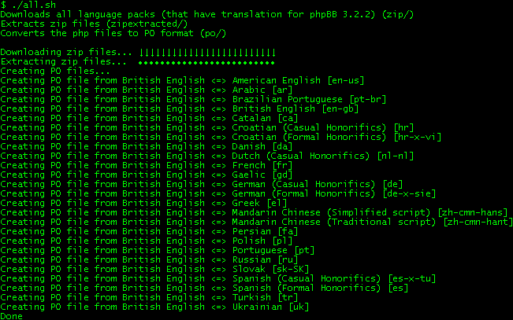

## phpBB PO Converter
# These shell scripts can extract the strings from the php files in language packs and create a single PO file.

You can then use the PO file to check for mistakes in many available tools that knows PO.

## Screenshot
# 

## Language packs

Can be found on [phpbb.com](https://www.phpbb.com/languages/] (also [phpbb.com](https://www.phpbb.com/customise/db/language_packs-25))
If you run the all.sh script it will download the language packs for you so you dont have to do it manually

## po.sh
# Creates a single PO file.

Run "./po.sh -h" for usage.

    Usage: ./po.sh [-a <first folder> -b <second folder>] [-c]
    Extracts strings from two phpBB language packs
    and combines the strings in a PO file.
    
    -a <folder>    Content of unpacked language pack zip file
                   (usually the source language which is british_english_[VERSION]
    -b <folder>    Content of unpacked language pack zip file
                   (usually the translation you work on e.g. danish_[VERSION]
                   Source and translation should be the same version
    -c             Delete the temporary files and folder
                   (temp/, zip/, zipextracted/, po/)
    -v             Version information

Example:

    ./po.sh -a british_english_3_2_2 -b danish_3_2_2

## all.sh
# Downloads 25 language pack zip files (those that are updated to phpBB 3.2.2), extracts them and uses po.sh to create PO files from all of them.

Example:

    ./all.sh

## checkpo.sh
# Checks the PO files created with all.sh

See what warning/error messages we can get.
This we can use to improve the code or the language packs so it will hopefully give zero warnings/errors in the future versions

## Tools
# Here are some tools that can be used to check for errors in PO files

[gettext](https://www.gnu.org/software/gettext/)  
[PyG3T](https://github.com/pyg3t/pyg3t)  
[http://toolkit.translatehouse.org/](Toolkit)  
GUI tools:  
[Virtaal](http://virtaal.translatehouse.org/)  
[Poedit](https://poedit.net/)  
[Qt Linguist](https://doc.qt.io/qt-5/linguist-translators.html)  

## Permission to run files
# chmod

If you get "command not found" or "Permission denied" you might need to run these commands before you can execute the files

    sudo chmod +x po.sh all.sh

## Convert PO file back to PHP files

Question: Can i convert the PO file back to the PHP files?
Answer: Nope.

Question: Why nope?
Answer: The shell scripts does not save info about what files the strings came from and comments that developers and translators might have left in the files are ignored.

Question: Can you make it?
Answer: I dont know. It sounds hard.

## Requirements
# What you need for the shell scripts to work

PHP
...(i will add more here when i find out what is needed to run the shell scripts)

## End note
# The scripts uses curl, unzip, sed, php so i guess lots of things can go wrong and im not good at writing shell scripts so feel free to help improve the code.
